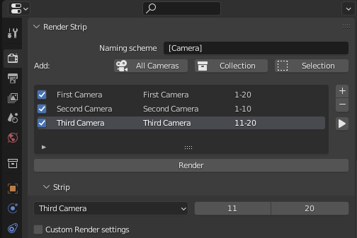

# Render Strip
**Blender addon to manage animation strips.**

## Installation

1. Download from Github latest [release](https://github.com/luckykadam/render-strip/releases/download/v1.0/render-strip-v1.0.zip) (do not unzip).
2. In blender, go to: Edit -> Preferences -> Add-ons -> Install.
3. Select the downloaded file and click on -> Install Add-on.
4. Enable it by clicking on checkbox.

You should now see Render Strip panel in Render Properties.

## Usage

1. Optionally configure a naming scheme for the strips
2. Create new strip by clicking on "+" button. (Optionally you can bulk add multiple cameras as strips by using one of the Add buttons: "All Cameras", "Collection" and "Selection")
3. Specify the camera, start frame and end frame.
4. Select the output path.
5. Hit Render.

5. Optionally set custom render settings for the strip.

6. For more control on ouptut, take a look at output settings sub-panel.

## Naming Schemes

Naming schemes use tags like [tag|option1|option2|...]. All Tags can be used without options like this as well: [tag].

> **Warning** 
> Using naming schemes that will generate characters that are not allowed in file names will lead to problems

### [Camera]
The [Camera] tag gets replaced with the Camera Name and regex options are available

Examples: 

If your camera is called `My_Camera.001`:

|           Naming Scheme              |              Strip Name            |
|--------------------------------------|------------------------------------|
|          `Strip [Camera]`            |        `Strip My_Camera.001`       |
|       `Strip [Camera\|\.\| ]`        |        `Strip My_Camera 001`       |
|   `Strip [Camera\|.*\.(.*)\|\1]`     |             `Strip 001`            |

### [Filename]
The [Filename] tag gets replaced with the Name of the file without extension. Regex options are available

Examples: 

If your filename is called `My_project R00`:

|           Naming Scheme              |              Strip Name            |
|--------------------------------------|------------------------------------|
|            `[Filename]`              |          `My_project R00`          |
|         `[Filename\|\_\| ]`          |          `My project R00`          |
|   `Image [Filename\|.*(R.*)\|\1]`    |             `Image R00`            |

### [DateTime]
The [DateTime] tag gets replaced with the date time string of the moment the strip was added. Date formating options are available using the strftime format specified [here](https://docs.python.org/3/library/datetime.html#strftime-strptime-behavior)

Examples: 

|           Naming Scheme              |              Strip Name            |
|--------------------------------------|------------------------------------|
|            `[DateTime]`              |         `2023-05-06 15:30`         |
|      `[Datetime\|%y-%m-%d\| ]`       |            `2023-05-06`            |

## Feedback

Feel free to report issues or provide feedback on Github.

## Credit

This is a fork of the original render-strip addon by [Lucky Kadam](https://twitter.com/luckykadam94). Original repository can be found at: https://github.com/luckykadam/render-strip
